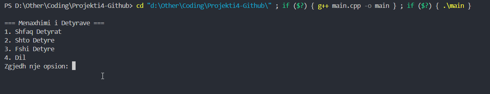
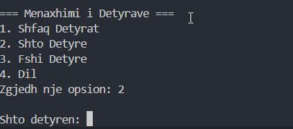
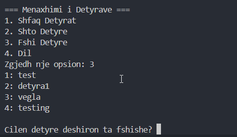

# **Grupi 30 - Projekti 4 (GitHub)**  

Ky është projekti i katërt në kuadër të lëndës **"Vegla Bazë Softuerike"**, i cili ka për qëllim përdorimin e platformës **GitHub** për menaxhimin e kodit burimor dhe bashkëpunimin në grup.  

## **Përshkrimi i projektit**  
Ky projekt përfaqëson një **aplikacion të thjeshtë për menaxhimin e detyrave** (*To-Do App*), i zhvilluar në gjuhën **C++**. Aplikacioni mundëson:  
- Shtimin e detyrave të reja.  
- Listimin e detyrave ekzistuese.  
- Fshirjen e detyrave sipas kërkesës së përdoruesit.  

## **Anëtarët e grupit**  
- **Arion Ukshini** – Menaxhimi i repository-t në GitHub, krijimi i menusë së programit (*menu.cpp*), përgatitja e README-së.  
- **Edison Ukshini** – Implementimi i funksionit kryesor (*main.cpp*), krijimi i mekanizmit për daljen nga programi, rishikimi dhe përmirësimi i kodit.  
- **Bardh Bibaj** – Implementimi i funksioneve për shtimin dhe listimin e detyrave.  
- **Tringa Hasani** – Implementimi i funksioneve për fshirjen e detyrave dhe menaxhimin e gabimeve (*error handling*).  

## **Struktura e projektit**  
- **main.cpp** – Përmban funksionin kryesor të programit dhe funksionet për menaxhimin e detyrave (shtim, listim, fshirje).  
- **menu.cpp** – Përmban funksionalitetin e menusë kryesore.  
- **detyrat.txt** – File për ruajtjen e detyrave të futura nga përdoruesi.  
- **README.md** – Dokumentacioni i projektit.  

## **Si të ekzekutoni projektin?**  
1. Klononi repository-n në pajisjen tuaj:  
   ```bash
   git clone https://github.com/ArionUkshiniUP/Grupi30-Github.git
   ```
2. Navigoni te direktoria e projektit:  
   ```bash
   cd Grupi30-Github
   ```
3. Kompiloni dhe ekzekutoni programin:  
   ```bash
   g++ main.cpp menu.cpp -o todoApp
   ./todoApp
   ```

### **Shembull i ekzekutimit të kodit**  
Më poshtë janë disa screenshote nga ekzekutimi i programit:

#### **Menyja Kryesore**  
  

#### **Shtimi i një detyre të re**  
  

#### **Fshirja e një detyre**  
  

## **Kontributet dhe versionimi**  
Ky projekt është menaxhuar përmes **GitHub**, duke përdorur:  
✅ **Branching dhe Pull Requests** për integrimin e ndryshimeve.  
✅ **Commit-e të rregullta** për të dokumentuar progresin.  
✅ **Issue Tracking** për identifikimin e problemeve dhe përmirësimeve.  
